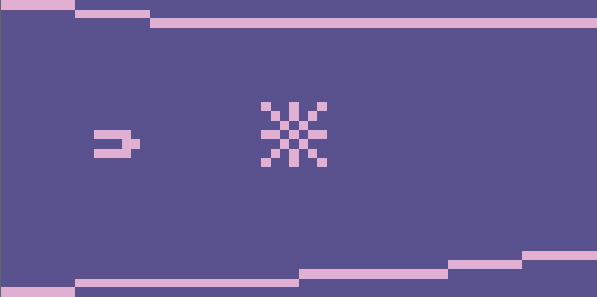

# CHIP-8 Emulator

This is my CHIP-8 Emulator, written in plain C++ and OpenGL as a fun side project. 
I originally wanted to compile it to WASM and integrate it to my website, but as it turns out, that is quite cumbersome. 
It didn't make things easier that I had used a bunch of legacy OpenGL either. That's because I didn't want to set up and create shaders
just to render some rectangles to the screen. I might revisit this project in the future and add WASM support, or I might not... 🤔





## Dependencies

- OpenGL
- GLUT

## Build

```bash
cmake -B build -S . && cmake --build build
```

## Run

```bash
build/chip8-emulator /path/to/rom
```

## ROMS

- https://github.com/kripod/chip8-roms/tree/master
- https://github.com/loktar00/chip8/tree/master/roms
